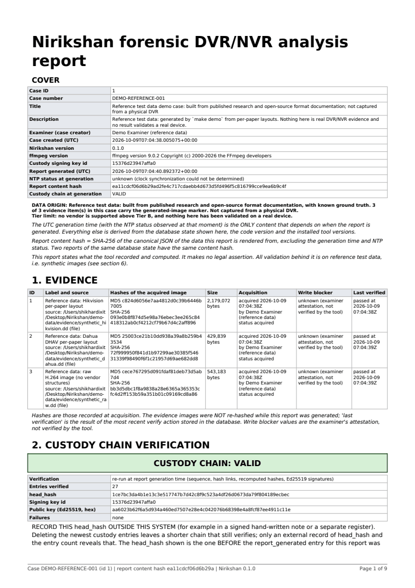

# Court-style report, JSON-LD export and draft certificate (P7)

Status: implemented and tested on reference test data only (generated, not captured from a physical DVR; technically "synthetic"). Nothing here asserts anything legal.

## What the report contains

`POST /api/cases/{id}/report` builds a PDF from the database and records it. Sections (headings appear verbatim in the PDF):

| Section | Content |
|---|---|
| COVER | case id/number/title/examiner, tool version, ffmpeg version, UTC generation time, NTP status (`unknown` when not detectable), report content hash, custody verdict, and the statement that the generation time (with its NTP status) is the only content that depends on when the report is made |
| 1. EVIDENCE | MD5, SHA-256, size, source path/type, acquisition time and examiner, write blocker shown as "examiner attestation, not verified by the tool", last verification result. Images are NOT re-hashed during generation |
| 2. CUSTODY CHAIN VERIFICATION | `custody.verify_chain` re-run at generation: VALID / FAILED banner, head_hash, entry count, key id, public key, every failure reason, a note to record head_hash outside the system, the custody log (16-char hash prefixes) |
| 3. CARVE RUNS | per run: parameters and parser option values (block_size_mode, master_sector_offset, time_basis_label, frame_gap_tolerance, join_gap, generic_scope, ...), vendor matches with tier, confidence and caveats, parser status, parsed/inferred/unknown counts, OPEN SOURCE CONFLICTS (conflict fields the parser emitted plus the documented conflicts in `timeline/timestamps.py`), cross-check disagreement counts by kind, the clip table (engine, codec, channel, offsets, bitstream and MP4 SHA-256, decode status, nominal duration with the "not recording time" note), and a separate FAILED DECODES, EXPORT FAILURES AND ORPHANS list |
| 4. TIMESTAMPS | per evidence: timezone assumption with the examiner's evidence notes, epoch basis, reference observations, drift model; PLACED TIMELINE with raw value/field/format/offset, wall clock as stored, uncorrected and corrected UTC intervals, flags; UNPLACEABLE CLIPS with the reason (clips without a timezone assumption are never placed) |
| 5. ANALYTICS | each run labelled "triage, not identification", model name/version/licence/SHA-256, parameters, clip hashes, measured error rates with their data source and caveats, nominal times |
| 6. LIMITATIONS | synthetic-only validation, circular parser checks, no vendor above Tier B, no real-device validation, a clean decode does not prove byte-faithfulness, reassembly false-accept rate read by code from `docs/validation/results.json` (reported as unknown if the file is unreadable), nominal durations, attestation limits, nothing legal asserted |
| 7. COLOPHON | library, font, coverage, reproducibility, how to verify |

Every page has a footer with the case number, the first 16 hex characters of the content hash and "Page x of y". Tables repeat their header row and split across pages; very long tables are truncated at 300 rows with a visible "Truncated" note (the data stays in the database). Not included in v1: the API audit trail (it changes with every request and would break reproducibility) and OSD cross-check results.

## Reproducibility and recording

* `content_hash` = SHA-256 of the canonical JSON of the report data without the `generated` block (generation time, NTP status). Same database state and code give the same content hash.
* ReportLab runs with `invariant=1` and constant metadata. The same data and the same `generated_at` give byte-identical PDFs; with another `generated_at` only the lines carrying the generation time differ (both tested).
* Generating writes a custody entry `report_generated` with: report id, file name, PDF SHA-256, size, pages, content hash, `head_hash_built_from` (the chain head BEFORE this entry; the PDF states the same), entry count, chain verdict, generation time, NTP status, tool/ffmpeg/library versions and parameters. The PDF is stored read-only (0444) under `<data>/cases/<id>/reports/` and registered in the `reports` table. A report cannot contain its own file hash; that hash lives in the custody entry and the table.
* `GET /api/reports/{id}/download` re-hashes the file and answers 409 if it is missing or no longer matches.

## Library, licences, fonts

| Component | Version tested | Licence | Use |
|---|---|---|---|
| ReportLab | 5.0.1 | BSD-3-Clause | PDF generation, offline |
| pypdf | 6.19.0 | BSD-3-Clause | text extraction in tests only |
| Bitstream Vera Sans (Vera, VeraBd, VeraIt), shipped inside ReportLab | n/a | Bitstream Vera Fonts licence (permissive; may be bundled and redistributed, not sold by itself) | embedded as TrueType subsets |

ReportLab also pulls in Pillow (HPND) and charset-normalizer (MIT). fpdf2 (LGPL) was deliberately not used. Coverage is **Latin only**: a character with no glyph in Vera is replaced by a visible marker such as `[U+4E2D]` and the number of replacements is kept (never dropped silently). Hashes are set in the proportional font (Vera ships no monospace face) and wrap across lines in table cells; strip whitespace when comparing.

## How to verify a report

1. SHA-256 of the PDF equals `sha256` in the `report_generated` custody entry and in `GET /api/cases/{id}/reports`.
2. Run chain verification; compare head_hash and entry count with your external record. The report's head_hash is the one before the `report_generated` entry.
3. Compare section 1 hashes with an independent hash of the image, and clip hashes with the exported MP4s.

## Draft certificate under Section 63(4) BSA 2023

`GET /api/cases/{id}/certificate-draft?evidence_id=` returns a PDF whose every page carries the banner "DRAFT for examiner and legal review, not legal advice. Nirikshan does not assert that this satisfies Section 63(4)." It pre-fills only recorded facts (image MD5 and SHA-256, label, source, acquisition time and examiner, write-blocker attestation, custody state) and leaves names, device make/model/serial/IMEI/MAC, the manner of production, the expert's statement, dates and signatures blank. What was and was not confirmed about the law is in `docs/legal/BSA-63-4-notes.md`. Generating a draft is not written to the custody log (it is a GET); the API audit trail records the request.

## JSON-LD export (not CASE-conformant)

`GET /api/cases/{id}/export.jsonld` exports case, evidence (hashes), custody entries (hash, previous hash, signature, key id, chain verdict) and clips. It is deterministic (no generation time; `@id` is `urn:nirikshan:<signing key id>:case:<id>...`).

**It is NOT CASE-conformant.** Terms verified on the public UCO ontology pages (accessed 2026-10-09) and borrowed:

| Term | IRI | Verified as |
|---|---|---|
| `uco-types:Hash` | https://ontology.unifiedcyberontology.org/uco/types/Hash | class |
| `uco-types:hashMethod` | .../uco/types/hashMethod | xsd:string, 1..1 |
| `uco-types:hashValue` | .../uco/types/hashValue | xsd:hexBinary, 1..1 |
| `uco-observable:ContentDataFacet` | https://ontology.unifiedcyberontology.org/uco/observable/ContentDataFacet | class, superclass core:Facet |
| `uco-observable:hash` | on ContentDataFacet | object property, "Hash values of the data" |
| `uco-observable:sizeInBytes` | on ContentDataFacet | datatype property |

Namespaces `.../uco/types/` and `.../uco/observable/` follow from those class IRIs. Everything else uses the `nk:` vocabulary (`urn:nirikshan:vocab:`), which has no published definitions. Not verified: the hashMethod vocabulary members (the export writes `MD5` and `SHA256`, plain strings), the SHACL shapes (they require properties such as `core:specVersion` that the export omits), the CASE investigation classes. The `core:UcoObject` page was read but its terms are not used.

## Sample

Page 1 of the report built from the demo case (reference test data; the cover block states the data origin and the Tier B limit):

## Limits

Validation is on synthetic images only; nothing here has been checked against a real recorder, a court, or an NTRO acceptance test. The report restates the tool's records; it does not make them true.
